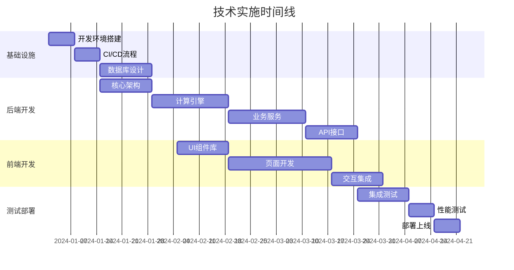

# 软件规模评估系统 - 项目实施计划

## 一、项目实施总体规划

### 1. 项目实施策略

#### 分阶段实施方案
```
阶段 1：基础平台搭建 (Sprint 0-2, 6周)
- 开发环境搭建
- 基础架构实现
- 核心计算引擎开发
- 基础UI组件开发

阶段 2：核心功能开发 (Sprint 3-6, 8周)
- NESMA功能点计算功能
- 成本计算功能
- 项目管理功能
- 基础报告功能

阶段 3：流程和集成 (Sprint 7-9, 6周)
- 审批工作流实现
- 系统集成测试
- 性能优化
- 安全加固

阶段 4：完善和部署 (Sprint 10-12, 6周)
- 功能完善和优化
- 全面测试
- 用户培训准备
- 生产环境部署
```

#### 风险控制策略
```
技术风险控制：
✓ 早期原型验证计算准确性
✓ 分层架构降低技术复杂度
✓ 持续集成确保代码质量
✓ 定期技术评审和重构

进度风险控制：
✓ 采用敏捷开发，快速迭代
✓ 设置里程碑检查点
✓ 并行开发提高效率
✓ 预留缓冲时间处理变更

质量风险控制：
✓ TDD测试驱动开发
✓ 代码审查机制
✓ 自动化测试覆盖
✓ 用户验收测试

团队风险控制：
✓ 技能培训和知识分享
✓ 关键人员备份方案
✓ 清晰的工作分工
✓ 有效的沟通机制
```

### 2. 技术实施路线图



## 二、Sprint规划详细方案

### Sprint 0: 项目启动和环境准备 (2周)

#### Sprint目标
- 完成开发环境搭建
- 建立项目基础架构
- 验证核心技术栈
- 制定详细开发计划

#### 开发任务分解

**基础环境搭建 (5天)**
```
Task 1.1: 开发工具配置 (1天)
- 安装和配置开发IDE
- 配置代码规范检查工具
- 设置Git工作流规范

Task 1.2: 项目脚手架创建 (2天)
- 创建前端Vue3项目结构
- 创建后端Spring Boot项目结构
- 配置项目依赖和构建工具

Task 1.3: 数据库环境搭建 (1天)
- 配置PostgreSQL开发环境
- 设置Redis缓存环境
- 配置MinIO对象存储

Task 1.4: CI/CD流程配置 (1天)
- 配置GitHub Actions
- 设置代码质量检查
- 配置自动化测试流程
```

**基础架构实现 (5天)**
```
Task 2.1: 后端基础架构 (3天)
- 实现分层架构基础类
- 配置安全认证框架
- 实现统一异常处理
- 配置日志和监控

Task 2.2: 前端基础架构 (2天)
- 配置路由和状态管理
- 实现通用组件库
- 配置API通信层
- 实现主题和样式系统
```

**Sprint输出物**
- [x] 完整的开发环境
- [x] 可运行的项目骨架
- [x] 基础架构代码
- [x] 技术验证报告

### Sprint 1: 核心计算引擎开发 (2周)

#### Sprint目标
- 实现NESMA功能点计算核心算法
- 建立数据模型和验证机制
- 完成计算引擎单元测试
- 验证计算结果准确性

#### 开发任务分解

**数据模型设计 (3天)**
```
Task 1.1: 数据库表设计 (1天)
- 设计项目基础信息表
- 设计功能点计算数据表
- 设计计算结果存储表
- 创建数据库迁移脚本

Task 1.2: 实体类和DTO设计 (1天)
- 创建JPA实体类
- 设计API数据传输对象
- 实现对象映射关系
- 添加数据验证注解

Task 1.3: 数据访问层实现 (1天)
- 实现Repository接口
- 编写复杂查询方法
- 实现数据访问测试
```

**计算引擎实现 (5天)**
```
Task 2.1: ILF计算实现 (1天)
- 实现内部逻辑文件复杂度判定
- 实现功能点数计算逻辑
- 编写计算过程记录
- 添加单元测试

Task 2.2: EIF计算实现 (1天)
- 实现外部接口文件复杂度判定
- 实现功能点数计算逻辑
- 编写计算过程记录
- 添加单元测试

Task 2.3: EI计算实现 (1天)
- 实现外部输入复杂度判定
- 实现功能点数计算逻辑
- 编写计算过程记录
- 添加单元测试

Task 2.4: EO计算实现 (1天)
- 实现外部输出复杂度判定
- 实现功能点数计算逻辑
- 编写计算过程记录
- 添加单元测试

Task 2.5: EQ计算实现 (1天)
- 实现外部查询复杂度判定
- 实现功能点数计算逻辑
- 编写计算过程记录
- 添加单元测试
```

**计算验证和优化 (2天)**
```
Task 3.1: 计算结果验证 (1天)
- 使用PDF指南案例验证计算结果
- 实现计算过程审计记录
- 添加数据一致性检查

Task 3.2: 性能优化 (1天)
- 优化计算算法性能
- 实现计算结果缓存
- 添加计算超时控制
```

**Sprint输出物**
- [x] 完整的NESMA计算引擎
- [x] 全面的单元测试覆盖
- [x] 计算准确性验证报告
- [x] 性能测试报告

### Sprint 2: 成本计算和项目管理 (2周)

#### Sprint目标
- 实现成本计算引擎
- 完成项目管理基础功能
- 建立数据验证和质量控制机制
- 实现基础API接口

#### 开发任务分解

**成本计算引擎 (4天)**
```
Task 1.1: 成本计算模型 (1天)
- 实现成本计算公式
- 设计调整因子管理
- 实现计算参数配置
- 添加计算精度控制

Task 1.2: 调整因子管理 (1天)
- 实现软件类别调整因子
- 实现质量特性调整系数
- 实现信创调整系数管理
- 实现人月费用标准管理

Task 1.3: 成本计算集成 (1天)
- 集成功能点计算结果
- 实现成本计算流程
- 添加计算历史记录
- 实现计算结果比较

Task 1.4: 成本计算测试 (1天)
- 编写成本计算单元测试
- 使用指南案例验证结果
- 性能测试和优化
```

**项目管理功能 (4天)**
```
Task 2.1: 项目基础管理 (2天)
- 实现项目CRUD操作
- 实现项目状态管理
- 实现项目分类和标签
- 添加项目搜索和筛选

Task 2.2: 项目数据管理 (1天)
- 实现项目附件管理
- 实现项目历史版本
- 实现数据导入导出
- 添加数据备份机制

Task 2.3: 权限控制实现 (1天)
- 实现用户角色管理
- 实现项目权限控制
- 实现操作权限验证
- 添加权限测试用例
```

**API接口实现 (2天)**
```
Task 3.1: 核心API接口 (1天)
- 实现项目管理API
- 实现计算功能API
- 实现成本计算API
- 添加API文档

Task 3.2: API测试和优化 (1天)
- 编写API集成测试
- 实现API性能优化
- 添加API安全验证
- 完善错误处理机制
```

**Sprint输出物**
- [x] 成本计算引擎
- [x] 项目管理功能
- [x] 完整的API接口
- [x] 集成测试报告

### Sprint 3: 前端基础功能开发 (2周)

#### Sprint目标
- 实现前端基础架构和组件库
- 完成项目管理界面
- 实现功能点计算界面
- 建立前后端数据交互

#### 开发任务分解

**基础组件和布局 (4天)**
```
Task 1.1: 基础UI组件 (2天)
- 实现通用表单组件
- 实现数据表格组件
- 实现导航和菜单组件
- 实现通知和提示组件

Task 1.2: 布局和主题 (1天)
- 实现主布局组件
- 实现响应式设计
- 配置主题色彩系统
- 实现暗色模式支持

Task 1.3: 路由和状态管理 (1天)
- 配置页面路由
- 实现状态管理架构
- 实现用户认证状态
- 添加权限路由守卫
```

**项目管理界面 (3天)**
```
Task 2.1: 项目列表页面 (1天)
- 实现项目列表展示
- 实现搜索和筛选功能
- 实现分页和排序
- 添加批量操作功能

Task 2.2: 项目详情页面 (1天)
- 实现项目详情展示
- 实现项目信息编辑
- 实现项目状态管理
- 添加项目历史记录

Task 2.3: 项目创建页面 (1天)
- 实现项目创建表单
- 实现表单数据验证
- 实现步骤向导界面
- 添加数据保存逻辑
```

**功能点计算界面 (3天)**
```
Task 3.1: 计算数据录入 (2天)
- 实现ILF、EIF数据录入界面
- 实现EI、EO、EQ数据录入界面
- 实现数据验证和提示
- 添加计算过程指导

Task 3.2: 计算结果展示 (1天)
- 实现计算结果展示界面
- 实现计算过程详情展示
- 实现结果对比和分析
- 添加结果导出功能
```

**Sprint输出物**
- [x] 前端基础架构
- [x] 项目管理界面
- [x] 功能点计算界面
- [x] 前后端集成测试

### Sprint 4: 成本计算和报告功能 (2周)

#### Sprint目标
- 完成成本计算界面开发
- 实现报告生成功能
- 建立完整的数据流程
- 完成核心功能集成测试

#### 开发任务分解

**成本计算界面 (3天)**
```
Task 1.1: 调整因子配置 (1天)
- 实现调整因子选择界面
- 实现参数配置表单
- 添加参数说明和帮助
- 实现配置预设管理

Task 1.2: 成本计算过程 (1天)
- 实现成本计算界面
- 实现实时计算预览
- 显示计算公式过程
- 添加结果验证提示

Task 1.3: 成本分析展示 (1天)
- 实现成本组成分析图表
- 实现历史成本对比
- 实现敏感性分析
- 添加成本预测功能
```

**报告生成功能 (5天)**
```
Task 2.1: 报告模板设计 (1天)
- 设计功能点计算报告模板
- 设计成本估算报告模板
- 设计综合评估报告模板
- 实现模板配置管理

Task 2.2: 报告数据组装 (1天)
- 实现报告数据收集逻辑
- 实现计算过程数据格式化
- 实现图表数据生成
- 添加数据完整性检查

Task 2.3: 报告生成引擎 (2天)
- 实现PDF报告生成
- 实现Word报告生成
- 实现Excel数据导出
- 添加报告生成队列

Task 2.4: 报告管理界面 (1天)
- 实现报告列表管理
- 实现报告预览功能
- 实现报告下载管理
- 添加报告分享功能
```

**数据流程集成 (2天)**
```
Task 3.1: 完整流程测试 (1天)
- 测试项目创建到报告生成流程
- 验证数据一致性和准确性
- 测试异常情况处理
- 优化用户体验

Task 3.2: 性能优化 (1天)
- 优化页面加载性能
- 优化大数据量处理
- 实现数据缓存机制
- 添加加载状态提示
```

**Sprint输出物**
- [x] 成本计算完整功能
- [x] 报告生成系统
- [x] 核心业务流程
- [x] 端到端测试报告

### Sprint 5-6: 审批工作流和系统集成 (4周)

#### Sprint目标
- 实现多级审批工作流
- 完成系统安全加固
- 实现系统监控和日志
- 完成全面的集成测试

#### 主要开发内容

**审批工作流 (2周)**
- 工作流引擎实现
- 审批节点配置
- 审批界面开发
- 流程状态跟踪

**安全和监控 (1周)**
- 权限控制完善
- 审计日志实现
- 系统监控配置
- 安全测试

**系统集成 (1周)**
- 全功能集成测试
- 性能压力测试
- 兼容性测试
- 安全渗透测试

## 三、开发团队协作规范

### 1. 日常工作流程

#### 每日站会 (Daily Standup)
```
时间: 每天上午9:30, 15分钟
参与者: 全体开发团队成员
格式:
- 昨天完成了什么
- 今天计划做什么
- 遇到什么问题或阻碍

汇报模板:
"昨天我完成了[具体任务]，今天计划[具体计划]，
目前遇到[具体问题]需要[具体帮助]"

问题处理:
- 技术问题: 会后技术小组讨论
- 阻碍问题: Scrum Master协调解决
- 需求问题: Product Owner澄清确认
```

#### 代码协作流程
```
1. 任务领取:
   - 从Sprint Backlog选择任务
   - 更新任务状态为"进行中"
   - 创建feature分支开始开发

2. 开发过程:
   - 遵循编码规范
   - 编写单元测试
   - 定期提交代码
   - 及时同步develop分支

3. 代码提交:
   - 自测通过后创建Pull Request
   - 通过代码审查
   - 合并到develop分支
   - 更新任务状态为"完成"

4. 集成测试:
   - 参与集成测试
   - 修复发现的问题
   - 确保功能正常工作
```

### 2. 质量保证机制

#### 代码质量控制
```
自动化检查:
✓ 代码规范检查 (ESLint, Checkstyle)
✓ 单元测试覆盖率 (≥80%)
✓ 代码重复度检查 (≤5%)
✓ 安全漏洞扫描

人工审查:
✓ 功能实现正确性
✓ 代码可读性和维护性
✓ 性能和安全考虑
✓ 测试用例完整性

持续集成:
✓ 自动构建和测试
✓ 代码质量报告
✓ 部署到测试环境
✓ 自动化验收测试
```

#### 缺陷管理流程
```
缺陷发现:
- 开发自测发现
- 代码审查发现
- 集成测试发现
- 用户反馈问题

缺陷处理:
1. 记录缺陷详细信息
2. 评估缺陷优先级和影响
3. 分配给相应开发人员
4. 修复并验证
5. 更新缺陷状态

缺陷分类:
- P0: 阻塞性缺陷，立即修复
- P1: 严重缺陷，当天修复
- P2: 一般缺陷，本Sprint修复
- P3: 轻微缺陷，后续Sprint修复
```

## 四、风险管理和应对策略

### 1. 技术风险管理

#### 主要技术风险识别
```
计算准确性风险:
风险描述: NESMA计算结果与指南不一致
应对策略: 
- 早期原型验证
- 逐个案例对比测试
- 专家评审计算逻辑
- 建立计算结果审计机制

性能风险:
风险描述: 大数据量计算性能不足
应对策略:
- 算法优化和缓存机制
- 异步处理和队列机制
- 数据库查询优化
- 负载测试和调优

兼容性风险:
风险描述: 浏览器兼容性问题
应对策略:
- 支持主流浏览器版本
- 渐进式增强设计
- 兼容性测试覆盖
- 降级方案准备
```

### 2. 进度风险管理

#### 进度控制措施
```
Sprint计划:
- 合理估算任务工作量
- 预留15%缓冲时间
- 识别关键路径任务
- 设置里程碑检查点

进度跟踪:
- 每日更新任务进度
- 燃尽图监控Sprint进展
- 及时调整计划和资源
- 风险早期预警机制

应急方案:
- 功能优先级调整
- 人员资源重新分配
- 技术方案简化
- 外部支持获取
```

### 3. 质量风险管理

#### 质量保证策略
```
开发阶段:
✓ TDD测试驱动开发
✓ 代码审查强制执行
✓ 静态代码分析
✓ 持续集成构建

测试阶段:
✓ 单元测试覆盖率≥80%
✓ 集成测试自动化
✓ 用户验收测试
✓ 性能和安全测试

发布阶段:
✓ 预发布环境验证
✓ 数据库迁移测试
✓ 回滚方案准备
✓ 监控告警配置
```

## 五、项目成功标准

### 1. 功能完成标准

```
核心功能完成度: 100%
- NESMA功能点计算准确性100%符合指南
- 成本计算结果精度满足政府要求
- 审批工作流程完整可用
- 报告生成功能正常

性能标准达成:
- 页面响应时间 < 2秒
- 计算处理时间 < 5秒
- 系统并发用户数 ≥ 100
- 系统可用性 ≥ 99.5%

质量标准达成:
- 代码测试覆盖率 ≥ 80%
- 代码质量评级 ≥ A
- 安全漏洞数量 = 0
- 用户体验评分 ≥ 8分
```

### 2. 交付物完成标准

```
技术交付物:
✓ 完整的系统源代码
✓ 数据库设计文档和脚本
✓ API接口文档
✓ 部署和运维文档
✓ 测试报告和用例

培训交付物:
✓ 用户操作手册
✓ 管理员手册
✓ 培训课件和视频
✓ 常见问题解答

部署交付物:
✓ 生产环境部署
✓ 数据迁移完成
✓ 监控系统配置
✓ 备份恢复机制
```

通过这个详细的实施计划，我们可以确保软件规模评估系统按时、按质、按要求完成开发和部署，满足政府部门的各项需求。