# 🛠️ 长沙市财政评审中心软件规模评估系统
## 运维操作手册与应急预案

### 🎯 运维目标

**核心目标**: 确保长沙市财政评审中心软件规模评估系统稳定运行，为政府投资信息化项目评审提供可靠的技术支撑。

**服务水平目标(SLA)**:
- **系统可用性**: ≥99.5% (年停机时间<43.8小时)
- **响应时间**: 平均响应时间<2秒，95%请求<3秒
- **故障恢复时间**: 一般故障<30分钟，严重故障<2小时
- **数据完整性**: 100%，零数据丢失
- **安全事件**: 零安全漏洞，快速响应安全威胁

### 🏗️ 系统架构概览

#### 核心组件清单
```
前端层:
├── Nginx负载均衡器 (2台)
│   ├── 主服务器: manday-nginx-01
│   └── 备服务器: manday-nginx-02
├── Vue.js前端应用 (2台)
│   ├── 主服务器: manday-frontend-01
│   └── 备服务器: manday-frontend-02

应用层:
├── Spring Boot应用服务 (2台)
│   ├── 节点1: manday-backend-01
│   └── 节点2: manday-backend-02

数据层:
├── PostgreSQL数据库
│   ├── 主数据库: manday-db-master
│   └── 从数据库: manday-db-replica
├── Redis缓存集群
│   ├── 主缓存: manday-redis-master
│   └── 从缓存: manday-redis-replica

监控层:
├── Prometheus监控服务
├── Grafana可视化平台
├── AlertManager告警管理
└── ELK日志分析系统
```

### 📋 日常运维操作手册

#### 1. 系统健康检查

**每日健康检查清单** (执行时间：每天上午9:00)

```bash
#!/bin/bash
# 日常健康检查脚本
# 文件位置：/opt/manday-assess/scripts/daily-health-check.sh

echo "=== 长沙财政评审系统健康检查报告 $(date) ==="

# 1. 检查系统负载
echo "1. 系统负载检查:"
uptime
echo ""

# 2. 检查磁盘空间
echo "2. 磁盘空间检查:"
df -h | grep -E "(/$|/opt|/var)"
echo ""

# 3. 检查Docker服务状态
echo "3. Docker服务状态:"
docker ps --format "table {{.Names}}\t{{.Status}}\t{{.Ports}}"
echo ""

# 4. 检查应用服务健康状态
echo "4. 应用健康检查:"
check_service_health() {
    local service_name=$1
    local health_url=$2
    
    if curl -s -f "$health_url" > /dev/null; then
        echo "✓ $service_name: 正常"
    else
        echo "✗ $service_name: 异常"
        return 1
    fi
}

check_service_health "Nginx" "http://localhost/health"
check_service_health "后端API" "http://localhost/api/actuator/health"
check_service_health "前端应用" "http://localhost/"

# 5. 检查数据库连接
echo ""
echo "5. 数据库连接检查:"
docker exec manday-postgres-master pg_isready -U manday_user -d manday_assess
if [ $? -eq 0 ]; then
    echo "✓ PostgreSQL: 连接正常"
else
    echo "✗ PostgreSQL: 连接异常"
fi

# 6. 检查Redis缓存
echo ""
echo "6. Redis缓存检查:"
docker exec manday-redis-master redis-cli ping
if [ $? -eq 0 ]; then
    echo "✓ Redis: 连接正常"
else
    echo "✗ Redis: 连接异常"
fi

# 7. 检查关键业务指标
echo ""
echo "7. 业务指标统计:"
echo "今日项目数量: $(docker exec manday-postgres-master psql -U manday_user -d manday_assess -t -c "SELECT COUNT(*) FROM simple_project WHERE DATE(created_at) = CURRENT_DATE;")"
echo "今日计算次数: $(docker exec manday-postgres-master psql -U manday_user -d manday_assess -t -c "SELECT COUNT(*) FROM calculation_result WHERE DATE(created_at) = CURRENT_DATE;")"
echo "活跃用户数量: $(docker exec manday-postgres-master psql -U manday_user -d manday_assess -t -c "SELECT COUNT(DISTINCT created_by) FROM simple_project WHERE DATE(updated_at) = CURRENT_DATE;")"

echo ""
echo "=== 健康检查完成 ==="
```

**每周维护任务** (执行时间：每周日凌晨2:00)

```bash
#!/bin/bash
# 每周维护脚本
# 文件位置：/opt/manday-assess/scripts/weekly-maintenance.sh

echo "=== 开始每周维护任务 $(date) ==="

# 1. 清理日志文件
echo "1. 清理过期日志..."
find /opt/manday-assess/logs -type f -name "*.log" -mtime +30 -delete
find /var/log/docker -type f -name "*.log" -mtime +7 -delete
echo "日志清理完成"

# 2. 清理Docker资源
echo "2. 清理Docker资源..."
docker system prune -f
docker image prune -f
docker volume prune -f
echo "Docker资源清理完成"

# 3. 数据库维护
echo "3. 数据库维护..."
docker exec manday-postgres-master psql -U manday_user -d manday_assess -c "VACUUM ANALYZE;"
docker exec manday-postgres-master psql -U manday_user -d manday_assess -c "REINDEX DATABASE manday_assess;"
echo "数据库维护完成"

# 4. 更新系统指标统计
echo "4. 生成系统运行报告..."
{
    echo "=== 系统运行周报 $(date +%Y年%m月%d日) ==="
    echo ""
    echo "1. 系统运行时长:"
    uptime
    echo ""
    echo "2. 资源使用统计:"
    echo "CPU平均负载: $(uptime | awk -F'load average:' '{print $2}')"
    echo "内存使用率: $(free | grep Mem | awk '{printf "%.1f%%", $3/$2 * 100.0}')"
    echo "磁盘使用率: $(df -h / | awk 'NR==2{printf "%s", $5}')"
    echo ""
    echo "3. 业务数据统计:"
    echo "本周新增项目: $(docker exec manday-postgres-master psql -U manday_user -d manday_assess -t -c "SELECT COUNT(*) FROM simple_project WHERE created_at >= CURRENT_DATE - INTERVAL '7 days';")"
    echo "本周计算次数: $(docker exec manday-postgres-master psql -U manday_user -d manday_assess -t -c "SELECT COUNT(*) FROM calculation_result WHERE created_at >= CURRENT_DATE - INTERVAL '7 days';")"
} > /opt/manday-assess/reports/weekly_report_$(date +%Y%m%d).txt

echo "系统报告生成完成"
echo "=== 每周维护任务完成 ==="
```

#### 2. 性能监控和优化

**性能监控指标**
```yaml
系统性能指标:
  CPU使用率: <80%
  内存使用率: <85%
  磁盘使用率: <85%
  网络带宽: <70%

应用性能指标:
  响应时间: <2秒 (95%请求)
  吞吐量: >100 TPS
  错误率: <1%
  并发用户数: >50

数据库性能指标:
  连接数: <150 (最大200)
  查询响应时间: <500ms
  锁等待时间: <100ms
  缓存命中率: >90%
```

**性能优化脚本**
```bash
#!/bin/bash
# 性能优化脚本
# 文件位置：/opt/manday-assess/scripts/performance-optimization.sh

echo "=== 开始性能优化 $(date) ==="

# 1. Java应用内存优化
echo "1. 优化Java应用内存配置..."
# 重启应用容器以应用新的JVM参数
docker-compose -f /opt/manday-assess/docker-compose.prod.yml restart backend-1 backend-2

# 2. 数据库性能优化
echo "2. 优化数据库性能..."
docker exec manday-postgres-master psql -U manday_user -d manday_assess << EOF
-- 更新表统计信息
ANALYZE;

-- 重建索引（如需要）
REINDEX INDEX CONCURRENTLY idx_project_created_at;
REINDEX INDEX CONCURRENTLY idx_calculation_project_id;

-- 检查慢查询
SELECT query, mean_time, calls 
FROM pg_stat_statements 
WHERE mean_time > 1000 
ORDER BY mean_time DESC 
LIMIT 10;
EOF

# 3. Redis缓存优化
echo "3. 优化Redis缓存..."
docker exec manday-redis-master redis-cli << EOF
# 清理过期键
EXPIRE cleanup 0
# 内存碎片整理
MEMORY PURGE
EOF

# 4. Nginx优化
echo "4. 重新加载Nginx配置..."
docker exec manday-nginx nginx -s reload

echo "=== 性能优化完成 ==="
```

#### 3. 数据备份和恢复

**自动备份脚本** (执行时间：每天凌晨3:00)
```bash
#!/bin/bash
# 自动备份脚本
# 文件位置：/opt/manday-assess/scripts/backup.sh

BACKUP_DIR="/opt/backup/manday-assess"
DATE=$(date +%Y%m%d_%H%M%S)
BACKUP_PATH="$BACKUP_DIR/$DATE"

echo "=== 开始数据备份 $(date) ==="

# 创建备份目录
mkdir -p $BACKUP_PATH

# 1. 数据库备份
echo "1. 备份PostgreSQL数据库..."
docker exec manday-postgres-master pg_dump -U manday_user -Fc manday_assess > "$BACKUP_PATH/database_backup.dump"
if [ $? -eq 0 ]; then
    echo "✓ 数据库备份完成"
else
    echo "✗ 数据库备份失败"
    exit 1
fi

# 2. 上传文件备份
echo "2. 备份上传文件..."
tar -czf "$BACKUP_PATH/uploads_backup.tar.gz" -C /opt/manday-assess/uploads .
echo "✓ 上传文件备份完成"

# 3. 配置文件备份
echo "3. 备份配置文件..."
cp -r /opt/manday-assess/config "$BACKUP_PATH/"
cp /opt/manday-assess/.env "$BACKUP_PATH/"
cp /opt/manday-assess/docker-compose.prod.yml "$BACKUP_PATH/"
echo "✓ 配置文件备份完成"

# 4. Redis数据备份
echo "4. 备份Redis数据..."
docker exec manday-redis-master redis-cli BGSAVE
sleep 10
docker cp manday-redis-master:/data/dump.rdb "$BACKUP_PATH/redis_backup.rdb"
echo "✓ Redis数据备份完成"

# 5. 创建备份清单
echo "5. 创建备份清单..."
{
    echo "备份时间: $(date)"
    echo "备份版本: $DATE"
    echo "数据库大小: $(du -h $BACKUP_PATH/database_backup.dump | cut -f1)"
    echo "上传文件大小: $(du -h $BACKUP_PATH/uploads_backup.tar.gz | cut -f1)"
    echo "总备份大小: $(du -sh $BACKUP_PATH | cut -f1)"
    echo ""
    echo "备份文件列表:"
    ls -la $BACKUP_PATH
} > "$BACKUP_PATH/backup_manifest.txt"

# 6. 压缩备份
echo "6. 压缩备份文件..."
tar -czf "$BACKUP_DIR/manday_backup_$DATE.tar.gz" -C $BACKUP_DIR $DATE
rm -rf $BACKUP_PATH

# 7. 清理旧备份（保留90天）
echo "7. 清理旧备份文件..."
find $BACKUP_DIR -name "manday_backup_*.tar.gz" -mtime +90 -delete

# 8. 发送备份报告
echo "8. 发送备份完成通知..."
BACKUP_SIZE=$(du -sh "$BACKUP_DIR/manday_backup_$DATE.tar.gz" | cut -f1)
echo "数据备份完成 - 时间: $(date), 大小: $BACKUP_SIZE" | \
    mail -s "财政评审系统备份完成" admin@changsha.gov.cn

echo "=== 数据备份完成 ==="
```

**数据恢复脚本**
```bash
#!/bin/bash
# 数据恢复脚本
# 文件位置：/opt/manday-assess/scripts/restore.sh

if [ $# -ne 1 ]; then
    echo "使用方法: $0 <备份文件路径>"
    echo "示例: $0 /opt/backup/manday-assess/manday_backup_20250909_030001.tar.gz"
    exit 1
fi

BACKUP_FILE=$1
RESTORE_DIR="/tmp/manday-restore-$(date +%s)"

echo "=== 开始数据恢复 $(date) ==="
echo "备份文件: $BACKUP_FILE"

# 1. 验证备份文件
if [ ! -f "$BACKUP_FILE" ]; then
    echo "✗ 备份文件不存在: $BACKUP_FILE"
    exit 1
fi

# 2. 解压备份文件
echo "1. 解压备份文件..."
mkdir -p $RESTORE_DIR
tar -xzf "$BACKUP_FILE" -C $RESTORE_DIR
BACKUP_NAME=$(basename "$BACKUP_FILE" .tar.gz)
BACKUP_PATH="$RESTORE_DIR/${BACKUP_NAME#manday_backup_}"

# 3. 停止应用服务
echo "2. 停止应用服务..."
docker-compose -f /opt/manday-assess/docker-compose.prod.yml stop backend-1 backend-2

# 4. 恢复数据库
echo "3. 恢复数据库..."
if [ -f "$BACKUP_PATH/database_backup.dump" ]; then
    docker exec manday-postgres-master dropdb -U manday_user manday_assess
    docker exec manday-postgres-master createdb -U manday_user manday_assess
    cat "$BACKUP_PATH/database_backup.dump" | \
        docker exec -i manday-postgres-master pg_restore -U manday_user -d manday_assess
    echo "✓ 数据库恢复完成"
else
    echo "✗ 数据库备份文件不存在"
    exit 1
fi

# 5. 恢复上传文件
echo "4. 恢复上传文件..."
if [ -f "$BACKUP_PATH/uploads_backup.tar.gz" ]; then
    rm -rf /opt/manday-assess/uploads/*
    tar -xzf "$BACKUP_PATH/uploads_backup.tar.gz" -C /opt/manday-assess/uploads/
    echo "✓ 上传文件恢复完成"
fi

# 6. 恢复Redis数据
echo "5. 恢复Redis数据..."
if [ -f "$BACKUP_PATH/redis_backup.rdb" ]; then
    docker-compose -f /opt/manday-assess/docker-compose.prod.yml stop redis-master
    docker cp "$BACKUP_PATH/redis_backup.rdb" manday-redis-master:/data/dump.rdb
    docker-compose -f /opt/manday-assess/docker-compose.prod.yml start redis-master
    echo "✓ Redis数据恢复完成"
fi

# 7. 重启所有服务
echo "6. 重启所有服务..."
docker-compose -f /opt/manday-assess/docker-compose.prod.yml up -d

# 8. 验证恢复结果
echo "7. 验证恢复结果..."
sleep 30
if curl -s -f http://localhost/api/actuator/health > /dev/null; then
    echo "✓ 系统恢复成功"
else
    echo "✗ 系统恢复失败，请检查日志"
    exit 1
fi

# 9. 清理临时文件
rm -rf $RESTORE_DIR

echo "=== 数据恢复完成 ==="
```

### 🚨 应急预案

#### 1. 系统完全宕机应急预案

**故障现象**: 系统完全无法访问，所有服务异常

**应急响应流程**:

**第一阶段：紧急响应（0-5分钟）**
```bash
# 1. 立即检查系统状态
systemctl status docker
docker ps -a

# 2. 检查服务器基础状态
top
df -h
free -h
netstat -tulnp

# 3. 紧急通知相关人员
echo "紧急故障：财政评审系统完全宕机 $(date)" | \
    mail -s "【紧急】系统宕机" admin@changsha.gov.cn
```

**第二阶段：快速诊断（5-15分钟）**
```bash
# 1. 查看系统日志
journalctl -u docker --since "10 minutes ago"
tail -n 100 /opt/manday-assess/logs/*/error.log

# 2. 检查Docker服务
docker-compose -f /opt/manday-assess/docker-compose.prod.yml ps
docker logs manday-nginx
docker logs manday-backend-1
docker logs manday-postgres-master

# 3. 检查网络连接
ping 8.8.8.8
nslookup manday-assess.changsha.gov.cn
```

**第三阶段：服务恢复（15-30分钟）**
```bash
# 1. 尝试重启服务
docker-compose -f /opt/manday-assess/docker-compose.prod.yml down
docker-compose -f /opt/manday-assess/docker-compose.prod.yml up -d

# 2. 如果重启失败，使用备份恢复
/opt/manday-assess/scripts/restore.sh /opt/backup/manday-assess/latest_backup.tar.gz

# 3. 验证服务恢复
/opt/manday-assess/scripts/health-check.sh
```

#### 2. 数据库故障应急预案

**故障现象**: 数据库连接异常、查询超时、数据不一致

**应急处理步骤**:
```bash
# 1. 检查数据库状态
docker exec manday-postgres-master pg_isready -U manday_user -d manday_assess

# 2. 检查数据库日志
docker logs manday-postgres-master --tail 100

# 3. 检查数据库连接数
docker exec manday-postgres-master psql -U manday_user -d manday_assess \
    -c "SELECT count(*) FROM pg_stat_activity;"

# 4. 检查锁等待情况
docker exec manday-postgres-master psql -U manday_user -d manday_assess \
    -c "SELECT * FROM pg_stat_activity WHERE wait_event IS NOT NULL;"

# 5. 紧急修复
# 如果是连接数过多
docker exec manday-postgres-master psql -U manday_user -d manday_assess \
    -c "SELECT pg_terminate_backend(pid) FROM pg_stat_activity WHERE state='idle' AND query_start < now() - interval '30 minutes';"

# 如果是死锁问题
docker exec manday-postgres-master psql -U manday_user -d manday_assess \
    -c "SELECT pg_cancel_backend(pid) FROM pg_stat_activity WHERE wait_event_type = 'Lock';"

# 6. 切换到只读副本（紧急情况）
# 修改应用配置指向只读副本
sed -i 's/postgres-master:5432/postgres-replica:5432/' /opt/manday-assess/config/application-prod.yml
docker-compose -f /opt/manday-assess/docker-compose.prod.yml restart backend-1 backend-2
```

#### 3. 性能异常应急预案

**故障现象**: 响应时间超过5秒、CPU使用率超过90%、内存不足

**应急处理步骤**:
```bash
# 1. 立即检查系统资源
top -b -n1 | head -20
free -h
iostat -x 1 3

# 2. 检查应用性能
# 查看最耗费资源的进程
docker stats --no-stream
ps aux --sort=-%cpu | head -10
ps aux --sort=-%mem | head -10

# 3. 临时性能优化
# 清理系统缓存
sync
echo 3 > /proc/sys/vm/drop_caches

# 重启高负载的服务
docker-compose -f /opt/manday-assess/docker-compose.prod.yml restart backend-1
# 等待30秒后重启第二个节点（确保服务连续性）
sleep 30
docker-compose -f /opt/manday-assess/docker-compose.prod.yml restart backend-2

# 4. 数据库性能优化
docker exec manday-postgres-master psql -U manday_user -d manday_assess << EOF
-- 终止长时间运行的查询
SELECT pg_cancel_backend(pid) FROM pg_stat_activity 
WHERE state = 'active' AND query_start < now() - interval '5 minutes';

-- 分析表统计信息
ANALYZE;
EOF
```

#### 4. 安全事件应急预案

**故障现象**: 检测到恶意攻击、异常登录、数据泄露风险

**应急响应流程**:

**第一阶段：立即隔离（0-2分钟）**
```bash
# 1. 阻止可疑IP访问
iptables -A INPUT -s <可疑IP> -j DROP

# 2. 启用严格防火墙规则
ufw --force enable
ufw default deny incoming
ufw allow from 192.168.0.0/16 to any port 22
ufw allow from 10.0.0.0/8 to any port 80,443

# 3. 强制所有用户重新登录
docker exec manday-redis-master redis-cli FLUSHDB
```

**第二阶段：威胁评估（2-10分钟）**
```bash
# 1. 检查访问日志
tail -n 1000 /opt/manday-assess/logs/nginx/access.log | \
    grep -E "(sql|script|alert|admin|\.\.)"

# 2. 检查应用日志中的异常
grep -i "error\|exception\|fail" /opt/manday-assess/logs/backend-*/app.log | tail -50

# 3. 检查数据库审计日志
docker exec manday-postgres-master psql -U manday_user -d manday_assess \
    -c "SELECT * FROM audit_log ORDER BY created_at DESC LIMIT 100;"
```

**第三阶段：安全加固（10-30分钟）**
```bash
# 1. 更新所有密码
# 生成新的JWT密钥
NEW_JWT_SECRET=$(openssl rand -base64 64)
sed -i "s/JWT_SECRET=.*/JWT_SECRET=$NEW_JWT_SECRET/" /opt/manday-assess/.env

# 2. 更新数据库密码
NEW_DB_PASSWORD=$(openssl rand -base64 32)
docker exec manday-postgres-master psql -U postgres -c "ALTER USER manday_user PASSWORD '$NEW_DB_PASSWORD';"
sed -i "s/DB_PASSWORD=.*/DB_PASSWORD=$NEW_DB_PASSWORD/" /opt/manday-assess/.env

# 3. 重启所有服务应用新配置
docker-compose -f /opt/manday-assess/docker-compose.prod.yml down
docker-compose -f /opt/manday-assess/docker-compose.prod.yml up -d

# 4. 启用额外的安全监控
# 启用fail2ban
systemctl enable fail2ban
systemctl start fail2ban
```

### 📞 应急联系人清单

#### 关键联系人
| 角色 | 姓名 | 电话 | 邮箱 | 责任范围 |
|------|------|------|------|----------|
| **系统负责人** | 待指定 | 138-xxxx-xxxx | admin@changsha.gov.cn | 整体协调决策 |
| **技术负责人** | 待指定 | 139-xxxx-xxxx | tech@changsha.gov.cn | 技术故障处理 |
| **数据库管理员** | 待指定 | 137-xxxx-xxxx | dba@changsha.gov.cn | 数据库相关问题 |
| **网络管理员** | 待指定 | 136-xxxx-xxxx | network@changsha.gov.cn | 网络连接问题 |
| **安全专员** | 待指定 | 135-xxxx-xxxx | security@changsha.gov.cn | 安全事件处理 |

#### 外部支持联系方式
| 服务商 | 联系方式 | 服务内容 | 响应时间 |
|--------|----------|----------|----------|
| **阿里云技术支持** | 400-xxx-xxxx | 云服务器、网络支持 | 24小时 |
| **硬件厂商** | 400-xxx-xxxx | 硬件故障处理 | 4小时内到场 |
| **软件厂商** | 400-xxx-xxxx | 软件BUG修复 | 2小时内响应 |

### 📊 故障处理流程

#### 故障分级标准
```yaml
一级故障 (Critical):
  - 系统完全宕机，无法访问
  - 数据丢失或严重损坏
  - 安全漏洞被利用
  响应时间: 立即 (0-15分钟)
  解决时间: 2小时内

二级故障 (High):
  - 系统功能严重受损
  - 性能严重下降（响应时间>5秒）
  - 部分用户无法正常使用
  响应时间: 30分钟内
  解决时间: 4小时内

三级故障 (Medium):
  - 系统功能部分受影响
  - 性能有所下降但可接受
  - 不影响核心业务功能
  响应时间: 2小时内
  解决时间: 8小时内

四级故障 (Low):
  - 系统功能轻微影响
  - 用户体验有所下降
  - 不影响业务正常进行
  响应时间: 4小时内
  解决时间: 24小时内
```

#### 故障处理标准流程

```mermaid
graph TD
    A[故障发现] --> B{故障分级}
    B -->|一级| C[立即通知所有相关人员]
    B -->|二级| D[通知技术团队]
    B -->|三级| E[通知值班人员]
    B -->|四级| F[记录问题，非急迫处理]
    
    C --> G[紧急应急处理]
    D --> G
    E --> H[标准故障处理]
    F --> I[计划维护处理]
    
    G --> J[问题定位]
    H --> J
    I --> J
    
    J --> K[解决方案实施]
    K --> L[功能验证]
    L --> M{验证是否通过}
    
    M -->|否| J
    M -->|是| N[故障关闭]
    N --> O[事后分析]
    O --> P[改进措施]
```


### 📈 系统监控指标

#### 关键性能指标(KPI)
```yaml
业务指标:
  日活跃用户数: >20人
  日新增项目数: >5个  
  日计算成功率: >99%
  用户满意度: >4.5分

技术指标:
  系统可用性: >99.5%
  平均响应时间: <2秒
  峰值并发用户: >50人
  错误率: <1%
  
基础设施指标:
  CPU使用率: <80%
  内存使用率: <85%
  磁盘使用率: <85%
  网络延迟: <50ms
```

#### 告警规则配置
```yaml
# Prometheus告警规则
groups:
- name: manday-critical-alerts
  rules:
  # 系统宕机告警
  - alert: SystemDown
    expr: up == 0
    for: 1m
    labels:
      severity: critical
      team: ops
    annotations:
      summary: "系统服务下线"
      description: "{{ $labels.instance }} 已下线超过1分钟"
      action: "立即检查服务状态并重启"

  # 响应时间过慢告警  
  - alert: SlowResponse
    expr: histogram_quantile(0.95, rate(http_request_duration_seconds_bucket[5m])) > 5
    for: 3m
    labels:
      severity: warning
      team: dev
    annotations:
      summary: "系统响应时间过慢"
      description: "95%请求响应时间超过5秒"
      
  # 数据库连接异常告警
  - alert: DatabaseConnectionFailed
    expr: pg_up == 0
    for: 1m
    labels:
      severity: critical
      team: dba
    annotations:
      summary: "数据库连接失败"
      description: "PostgreSQL数据库无法连接"
```

### 📋 运维检查清单

#### 日常检查清单
- [ ] 系统负载检查 (CPU、内存、磁盘)
- [ ] 所有容器状态正常
- [ ] 应用健康检查通过
- [ ] 数据库连接正常
- [ ] Redis缓存工作正常
- [ ] 日志文件无异常错误
- [ ] 备份任务执行成功
- [ ] 监控指标正常
- [ ] 安全告警检查
- [ ] 更新系统运行记录

#### 周度检查清单
- [ ] 性能趋势分析
- [ ] 容量规划评估  
- [ ] 安全漏洞扫描
- [ ] 备份恢复测试
- [ ] 监控规则优化
- [ ] 文档更新维护
- [ ] 团队培训计划
- [ ] 改进措施跟踪

#### 月度检查清单
- [ ] 系统架构评估
- [ ] 容量扩容计划
- [ ] 灾备演练执行
- [ ] 安全审计报告
- [ ] 运维成本分析
- [ ] SLA达成情况分析
- [ ] 用户满意度调研
- [ ] 运维流程改进

### 🎓 运维团队培训计划

#### 技能要求
```yaml
基础技能:
  - Linux系统管理
  - Docker容器技术
  - 网络基础知识
  - 数据库基本操作

专业技能:
  - PostgreSQL数据库管理
  - Redis缓存管理
  - Nginx配置调优
  - 监控系统使用

高级技能:
  - 性能调优技术
  - 自动化运维脚本
  - 安全防护措施
  - 故障分析能力
```

#### 培训计划
```
第一阶段: 基础培训 (2周)
- 系统架构理解
- 基本操作流程
- 监控工具使用
- 应急预案熟悉

第二阶段: 实操培训 (2周)
- 故障模拟演练
- 备份恢复操作
- 性能优化实践
- 安全事件处理

第三阶段: 高级培训 (1周)
- 自动化工具开发
- 架构优化建议
- 团队协作流程
- 持续改进机制
```

---

**文档编制**: Product Owner  
**技术审核**: Developer Engineer  
**运维审核**: DevOps Engineer  
**安全审核**: Security Specialist  
**最终审批**: Scrum Master  
**版本**: V1.0  
**创建时间**: 2025-09-09  

**重要提醒**: 运维工作事关重大，所有操作必须严格按照本手册执行，确保系统稳定可靠地为长沙市财政评审中心提供服务！